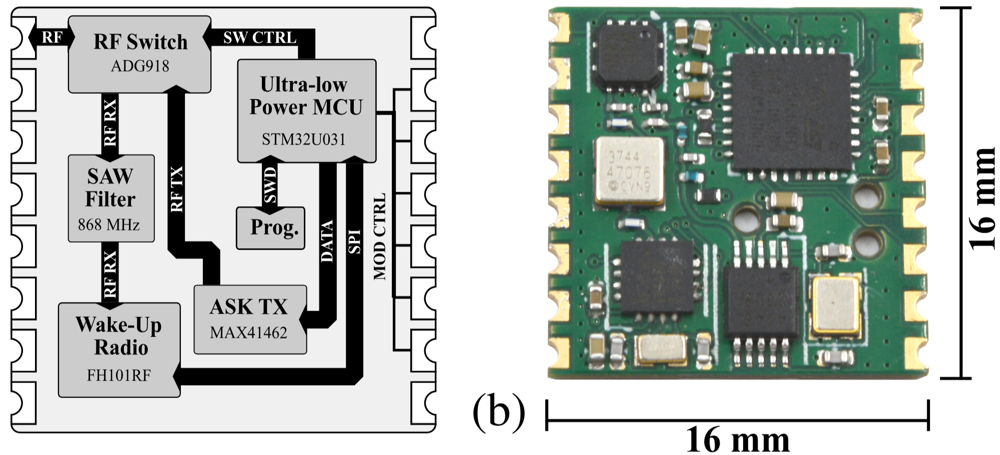

# WakeMod: An Open-Source Wake-up Transceiver Module

WakeMod is an open-source, ultra-low-power wake-up transceiver module designed for the 868 MHz ISM band,
facilitating easy integration of Wake-up Radio (WuR) capabilities into existing and new IoT systems. It aims
to significantly reduce idle power consumption while ensuring low-latency event responsiveness, crucial for
battery-powered, long-term deployments.

<p align="center"></p>

An in-depth analysis of the hardware can be found here: [arXiv](https://arxiv.org/abs/2505.21529)

> <div align="justify"> Large-scale IoT applications, such as asset tracking and remote sensing, demand multi-year battery lifetimes to minimize maintenance and operational costs. Traditional wireless protocols often employ duty cycling, introducing a tradeoff between latency and idle consumption -- both unsuitable for event-driven and ultra-low power systems. A promising approach to address these issues is the integration of always-on Wake-up Receivers (WuRs). They provide asynchronous, ultra-low power communication to overcome these constraints. This paper presents WakeMod, an open-source wake-up transceiver module for the 868 MHz ISM band. Designed for easy integration and ultra-low power consumption, it leverages the -75 dBm sensitive FH101RF WuR. WakeMod achieves a low idle power consumption of 6.9 µW while maintaining responsiveness with a sensitivity of -72.6 dBm. Reception of a wake-up call is possible from up to 130 m of distance with a -2.1 dBi antenna, consuming 17.7 µJ with a latency below 54.3 ms. WakeMod's capabilities have further been demonstrated in an e-ink price tag application, achieving 7.17 µW idle consumption and enabling an estimated 8-year battery life with daily updates on a standard CR2032 coin cell. WakeMod offers a practical solution for energy-constrained, long-term IoT deployments, requiring low-latency, and on-demand communication.</div>

If you use *WakeMod* in an academic or industrial context, please cite the following publication:

```bibtex
@misc{schultess25_wakem,
  author         = {Lukas Schulthess and Silvano Cortesi and Michele Magno},
  title          = {Wakemod: a 6.9uw Wake-Up Radio Module With -72.6dbm Sensitivity for On-Demand Iot},
  year           = 2025,
  doi            = {10.48550/ARXIV.2505.21529},
  url            = {https://arxiv.org/abs/2505.21529},
  eprint         = {2505.21529},
  archiveprefix  = {arXiv},
  primaryclass   = {cs.NI},
  DATE_ADDED     = {Sun Jun 1 12:42:45 2025},
}
```

## Features

*   Combines Wake-up Radio (WuR) Receiver and OOK Transmitter functionality.
*   Ultra-low power operation:
    *   Module idle consumption: 6.9 µW
    *   WuR sensitivity: -72.6 dBm
*   Onboard low-power STMicroelectronics STM32U031 MCU for control and I2C communication.
*   Frauenhofer FH101RF Wake-up Radio receiver (868.35 MHz).
*   Maxim Integrated MAX41462 OOK transmitter (868.35 MHz).
*   Analog Devices ADG918 RF switch for single antenna operation.
*   Standard I2C interface for communication with a host system.
*   Compact RFM69x-compatible footprint (16mm x 16mm).
*   Deep sleep mode controlled by `SYS_SDN` pin.
*   Interrupt output (`SYS_IRQ`) to signal received Wake-up Calls to the host.
*   Supports 6-byte custom payload transmission and reception.

## Hardware

*   **Main Components:**
    *   MCU: STMicroelectronics STM32U031
    *   WuR Receiver: Fraunhofer IIS FH101RF
    *   OOK Transmitter: Analog Devices MAX41462
    *   RF Switch: Analog Devices ADG918
*   **Footprint:** RFM69HW compatible (16mm x 16mm)
*   **Operating Frequency:** 868.35 MHz

### Pinout

| Pin Name  | Type   | Description                                                                    |
| :-------- | :----- | :----------------------------------------------------------------------------- |
| `VDD`     | Power  | Power Supply Voltage                                                           |
| `GND`     | Ground | Ground Connection                                                              |
| `SDA`     | I/O    | I2C Data Line                                                                  |
| `SCL`     | Input  | I2C Clock Line                                                                 |
| `SYS_SDN` | Input  | System Shutdown / Module Enable. **Active Low.** High for deep sleep.          |
| `SYS_IRQ` | Output | Interrupt Request to Host. **Active High.** Signals a Wake-up event occurred.  |
| `ANT`     | RF     | Antenna connection                                                             |

**Note:** While the footprint matches RFM69, the interface is **I2C**, not SPI. All other pins are currently unused.

## Firmware

The firmware architecture of the WakeMod module is optimized for ultra-low power consumption, keeping the
STM32U031 MCU in shutdown mode as much as possible. Critical data is retained in backup registers during
shutdown.

The MCU wakes up based on three primary sources:
1.  **System Reset:** The MCU transitions immediately back to shutdown to minimize power consumption.
2.  **WuR IRQ:** Upon a wake-up triggered by the FH101RF (e.g., address match), the module clears the
interrupt, retrieves the interrupt source and up to 6 bytes of payload data from the WuR. This information is
stored in the MCU's backup registers. The host MCU's `SYS_IRQ` pin is then asserted, and the module returns to     shutdown.
3.  **SYS_SDN Pin:** If the `SYS_SDN` pin transitions to low, the MCU wakes up and prepares its I2C slave     interface to receive commands from the host. When `SYS_SDN` returns high, the module re-enters shutdown.

## WakeMod as a Module: Detailed Usage

### Power States

*   **Active Mode:** When `SYS_SDN` is held LOW. The module is operational and ready to accept I2C 
commands.
*   **Deep Sleep Mode:** When `SYS_SDN` is HIGH. The module enters its lowest power state (STM32U031 in 
shutdown, peripherals off). I2C communication is disabled. The FH101RF Wake-up Radio remains functional and 
listening. To wake the module for I2C communication, bring `SYS_SDN` LOW. Allow a short time for the module to     initialize before sending I2C commands.

### Interrupt Handling (`SYS_IRQ`)

*   The `SYS_IRQ` pin becomes active (HIGH) when the FH101RF detects a valid Wake-up condition (e.g., matching address, pattern received) and the internal STM32U031 has processed this event.
*   The host system should detect this interrupt (e.g., on a rising edge).
*   After detecting the interrupt, the host should query the module using the `IRQ Reason` command (0x03) via I2C to determine the cause and retrieve any associated data.
*   Reading the `IRQ Reason` register de-asserts the `SYS_IRQ` pin. Reading it multiple times will return the same last IRQ reason until a new WuR event occurs.

### Communication Protocol (I2C)

*   **Interface:** I2C Slave
*   **Slave Address:** `0x2E` (7-bit address)
*   **Speed:** Max 10 kHz
*   **Control:** I2C communication is only possible when the `SYS_SDN` pin is LOW.

#### I2C Commands Overview

The WakeMod module supports four main commands initiated by the host MCU:

1.  **`WhoAmI` (0x00):** Reads a static device identifier. Used to verify communication.
2.  **`SetupWuR` (0x01):** Configures the FH101RF Wake-up Radio. This includes setting the 16-bit wake-up address, data rates (low and fast), and IRQ source mask. This command triggers a full calibration of the FH101RF.
3.  **`SendWuC` (0x02):** Transmits a Wake-up Call (WuC) using the MAX41462 OOK transmitter. This includes the target 16-bit wake-up address, data rates, and an optional 6-byte data payload. The internal STM32U031 
uses SPI for accurate timing of the preamble and address/payload transmission to the MAX41462.
4.  **`IRQReason` (0x03):** Retrieves the reason for the last wake-up event (from the FH101RF) and any received payload data. This data is read from the STM32U031's backup registers.

#### I2C Transaction Structure

*   **Write Operations (Host to WakeMod):**
    *   Used for `SetupWuR` (0x01) and `SendWuC` (0x02).
    *   The host initiates an I2C WRITE transaction to the slave address (`0x2E`).
    *   The host sends a total of **12 bytes** in a single transaction:
        1.  The 1-byte Command (e.g., `0x01` for `SetupWuR`).
        2.  Followed by 11 data bytes (Bytes 0-10 as defined in the table below).
    *   Example (`SendWuC`):
        `START | (0x2E << 1) | W | ACK | <CMD_BYTE (0x02)> | ACK | <Data Byte 0> | ACK | ... | <Data Byte     10> | ACK | STOP`

*   **Read Operations (Host from WakeMod):**
    *   Used for `WhoAmI` (0x00) and `IRQ Reason` (0x03).
    *   A combined I2C write-then-read sequence is used:
        1.  **Write Address Phase:** Host initiates an I2C WRITE transaction to `0x2E`. Send only **1 
byte**: the Command Byte (e.g., `0x00` for `WhoAmI`).
        2.  **Read Data Phase:** Host initiates an I2C READ transaction to `0x2E`. Read exactly **8 
bytes** of data from the module (Bytes 0-7 as defined in the table below).
    *   Example (`WhoAmI`):
        *   `START | (0x2E << 1) | W | ACK | <CMD_BYTE (0x00)> | ACK | REP_START | (0x2E << 1) | R | ACK |     <Read Byte 0> | ACK | ... | <Read Byte 7> | NACK | STOP`

#### I2C Command Byte Layout

| Command / Register       | Value | Type  | Byte 0                     | Byte 1                     | Byte 2                | Byte 3                | Byte 4                    | Byte 5                      | Byte     6             | Byte 7             | Byte 8             | Byte 9             | Byte 10            |
| :----------------------- | :---- | :---- | :------------------------- | :------------------------- | :-------------------- | :-------------------- | :------------------------ | :-------------------------- | :----------------- | :----------------- | :----------------- | :----------------- | :----------------- |
| **WhoAmI**               | 0x00  | Read  | `0x42` (ID MSB)            | `0x42` (ID LSB)            | `0x00` (Padding)      | `0x00` (Padding)      | `0x00` (Padding)          | `0x00` (Padding)            | `0x00` (Padding)   | `0x00` (Padding)   | *N/A*              | *N/A*              | *N/A*              |
| **SetupWuR**             | 0x01  | Write | Wake-up Addr [15:8]        | Wake-up Addr [7:0]         | Low     Data Rate (enum)  | Fast Data Rate (enum) | IRQ Source Mask           | Reserved `0x00`             | Reserved `0x00`    | Reserved `0x00`    | Reserved `0x00`    | Reserved `0x00`    | Reserved `0x00`    |
| **SendWuC**              | 0x02  | Write | Wake-up Addr [15:8]        | Wake-up Addr [7:0]         | Low     Data Rate (enum)  | Fast Data Rate (enum) | Send Add. Data Flag (LSb)   | Add. Data [0]               | Add.     Data [1]      | Add. Data [2]      | Add. Data [3]      | Add. Data [4]      | Add. Data [5]      |
| **IRQ Reason**           | 0x03  | Read  | IRQ Source Flags           | Recv Add. Data Flag (LSb)  | Received Data [0]     | Received Data [1]     | Received Data [2]         | Received Data [3]           | Received Data [4]  | Received Data [5]  | *N/A*              | *N/A*              | *N/A*              |

**Table Key:**

*   **Value:** The byte sent by the host to select the command/register.
*   **Type:** Indicates if the operation is a Read from or Write to the module *from the host's 
perspective*.
*   **Bytes 0-10 (Write):** Data payload sent by the host *after* the Command Byte for write operations. 
Total 11 data bytes.
*   **Bytes 0-7 (Read):** Data payload returned by the module during the read phase of a read operation. 
Total 8 data bytes.
*   **Wake-up Addr [15:8]:** Most Significant Byte (MSB) of the 16-bit Wake-up Address.
*   **Wake-up Addr [7:0]:** Least Significant Byte (LSB) of the 16-bit Wake-up Address.
*   **Data Rate (enum):** See `phy_speed` Enum Values table below.
*   **IRQ Source Mask/Flags:** See IRQ Source Bits table below. Bitmask used in `SetupWuR` (Byte 4) to 
enable specific FH101RF interrupt sources, or flags indicating occurred interrupts in `IRQ Reason` (Byte 0).
*   **Send Add. Data Flag (LSb):** Least Significant Bit of Byte 4 for `SendWuC`. `1` = Additional Data in     Bytes 5-10 (Add. Data [0-5]) is valid and should be sent. `0` = Additional Data is ignored (but bytes 5-10 
must still be sent, typically as `0x00`).
*   **Recv Add. Data Flag (LSb):** Least Significant Bit of Byte 1 for `IRQ Reason`. `1` = Received Data 
in Bytes 2-7 (Received Data [0-5]) is valid. `0` = No valid received data (Bytes 2-7 may be undefined).
*   **Add. Data [0-5] / Received Data [0-5]:** The 6-byte additional data payload for transmission or 
reception.
*   **Reserved / Padding:** These bytes must be included in the I2C transaction but their value is 
typically ignored or should be `0x00`. They ensure the fixed transaction length.
*   ***N/A*:** Not applicable for that transaction type (Reads return 8 data bytes, Writes expect 11 data     bytes following the command byte).

#### Data Definitions

##### `phy_speed` Enum Values (as per `OLDREADME.md` I2C values)
These values are used in the `SetupWuR` and `SendWuC` commands for the Low/Fast Data Rate bytes.

| Value (for I2C) | Speed (bps) |
| :-------------- | :---------- |
| 0x02            | 1024        |
| 0x03            | 2048        |
| 0x04            | 4096        |
| 0x05            | 8192        |
| 0x06            | 16384       |
| 0x07            | 32768       |

*Note:* For OOK transmission via MAX41462, data rates below 1024 bps (e.g., 256, 512 bps) do not work due to the MAX41462's auto-shutdown functionality. The FH101RF itself supports these lower rates for reception.

##### IRQ Source Bits (Byte 4 in `SetupWuR` / Byte 0 in `IRQ Reason`)
This byte indicates the cause of the interrupt (`IRQ Reason`) or configures which FH101RF events can cause an interrupt (`SetupWuR`). Multiple bits can be set. These bits correspond to the FH101RF's interrupt 
sources.

| Bit | Description                  | Notes (Primarily for FH101RF internal events)             |
| :-- | :--------------------------- | :-------------------------------------------------------- |
| 7   | Cyclic Timer Alarm           | Cyclic timer target reached.                              |
| 6   | RTC Timer Alarm              | One of the 4 RTC timers reached its target.               |
| 5   | ID Match & LDR               | Valid ID received, followed by transition to LDR mode.    |
| 4   | ID Match & FIFO Filled       | Valid ID received, followed by FIFO being filled.         |
| 3   | Correlation Pattern Match    | OOK data matches selected correlation sequence.           |
| 2   | FIFO Buffer Filled           | FIFO filled to configured length (e.g. 6 bytes for payload).|
| 1   | FIFO Overflow                | More data received than FIFO capacity.                    |
| 0   | ID Match                     | Received Fast Data Packet matches configured 16-bit ID.   |

### Basic Usage Flow

1.  **Power On & Enable:** Ensure `VDD` and `GND` are connected. Pull `SYS_SDN` LOW to enable the module. Wait briefly for startup if it was in deep sleep.
2.  **(Optional) Verify Communication:** Perform a `WhoAmI` (0x00) read sequence. Check for `0x4242` in 
the first two bytes.
3.  **Configure Receiver:** Perform a `SetupWuR` (0x01) write sequence with:
    *   Your desired 16-bit `Wake-up Address`.
    *   The `Low Data Rate` and `Fast Data Rate` (see `phy_speed` enum).
    *   The `IRQ Source Mask` to enable interrupts for relevant events (e.g., bit 0 for ID Match, bit 4 
for ID Match & FIFO Filled if expecting payload).
4.  **Enter Low Power (Host):** The host can now enter its own low-power mode, monitoring the `SYS_IRQ` 
pin. The WakeMod is now listening. Make sure `SYS_SDN` is pulled high for WakeMod to enter low-power state.
5.  **Handle Interrupt from WakeMod:** When `SYS_IRQ` goes HIGH:
    *   The host wakes up.
    *   Perform an `IRQ Reason` (0x03) read sequence (possibly short delay needed before readout).
    *   Parse `Byte 0` (IRQ Source Flags) to understand why the interrupt occurred.
    *   Check `Byte 1` (Recv Add. Data Flag). If its LSB is `1`, the 6 bytes of `Received Data` (Bytes 
2-7) are valid. Process this data.
    *   The read operation of `IRQ Reason` clears the `SYS_IRQ` pin on the WakeMod.
6.  **(Optional) Transmit a Wake-up Call:** If the host needs to wake another device:
    *   Ensure `SYS_SDN` is LOW.
    *   Perform a `SendWuC` (0x02) write sequence with:
        *   The target device's 16-bit `Wake-up Address`.
        *   `Low Data Rate` and `Fast Data Rate`.
        *   `Send Add. Data Flag` (set LSB of Byte 4 to `1` if sending payload).
        *   The 6-byte `Add. Data` payload (Bytes 5-10) if applicable.
7.  **Enter Deep Sleep (WakeMod):** When I2C communication is not needed for extended periods, set 
`SYS_SDN` HIGH to put the WakeMod into its lowest power deep sleep mode. The WuR (FH101RF) remains active.

## Folder Structure

*   `fw/Core/Src`: Contains the main source files for the STM32U031 firmware, including `main.c`, `i2c_slave.c` (I2C command handling), `utils.c` (helper functions), and HAL drivers.
*   `fw/Core/Inc`: Contains the corresponding header files, including `main.h`, `utils.h` (definitions, enums).
*   Other folders (`Drivers`, `Middlewares`, etc.) contain STM32CubeMX generated files and libraries.

## License

See the `LICENSE` file of the firmware respective hardware for details.
